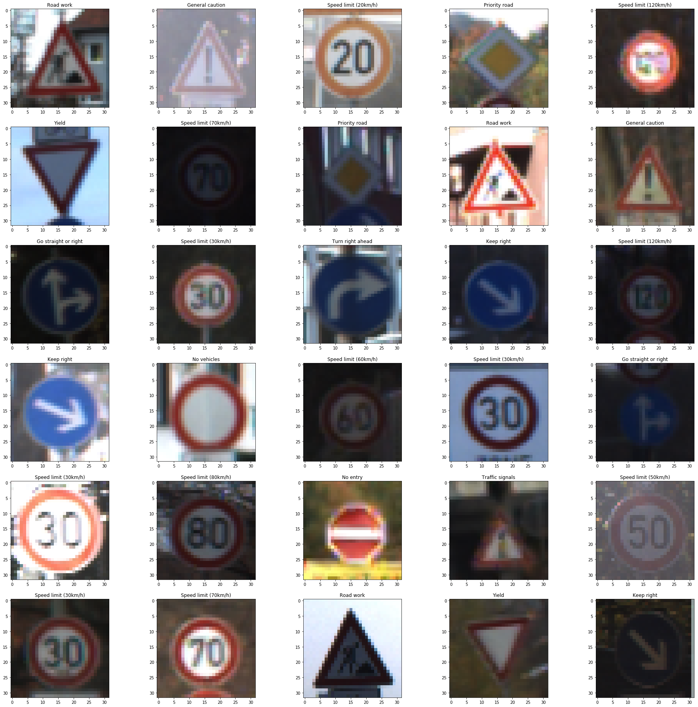
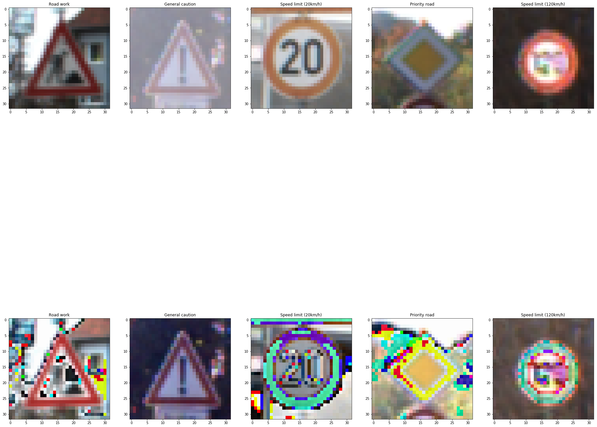
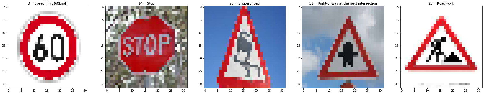

## Project: Build a Traffic Sign Recognition Program

Overview
---
This project uses the Lenet-5 Convolutional Neural Network introduced in the lesson to classify German traffic signs.

The Project
---
The goals / steps of this project are the following:
* Load the data set
* Explore, summarize and visualize the data set
* Design, train and test a model architecture
* Use the model to make predictions on new images
* Analyze the softmax probabilities of the new images
* Summarize the results with a written report

Data Set Summary & Exploration
---
##### Data Set Summary:
I used the pandas library to calculate summary statistics of the traffic signs data set:

Number of training examples = 34799.
Number of validation examples = 4410.
Number of testing examples = 12630.
Image data shape = (32, 32, 3).
Number of classes = 43.

##### An exploratory visualization of the data set:
Below is a visualization of the data set.
* The first two rows are from the training data.
* The middle two rows are from the validation data.
* The last two rows are from the test data set.

Design and Test a Model Architecture
---

### Normalize the image.
I used the formula provided (pixel - 128)/ 128) to normalize the RGB of a image.

Example below:

### Model Architecture:

The final architure is

| Layer    |Layer Name   	 | Description	        					|
|:--------:|:--------------------:|:--------------------------------------------:|
|          |Input          | Normalized 32x32x3 RGB image   							|
|  1       |Convolution 5x5     	| 1x1 stride, valid padding, outputs 38x38x6 	|
|          |RELU		              |Activates the output of the 1st layer|
|          |Conv1 Dropout | Using dropout to prevent overfitting.
| |Max pooling	      	| 2x2 stride, Input: 28x28x6  outputs 14x14x6 		|
| 2  |Convolution 5x5	    | 1x1 stride, valid padding, outputs 10x10x6 |
| |RELU		 |Activates the output of the 2nd layer
|          |Conv2 Dropout | Using dropout to prevent overfitting.
|          |Max pooling	  | 2x2 stride, Input: 28x28x6  outputs 5x5x16. 		|
|          |Flatten       | Flatten the from 5x5x16 to 400|
| 3        |Fully connected		|  Inputs: 400 Output:120   									|
| |RELU		 |Activates the output of the 3rd layer
|          |Fully connected Dropout | Using dropout to prevent overfitting.
| 4        |Fully connected		| Inputs: 120 Output:84         									|
|          |RELU		 |Activates the output of the 3rd layer|
|          |Fully connected Dropout | Using dropout to prevent overfitting.
| 5        |Fully connected		| Inputs: 84 Output:43         									|
| |Softmax				| Outputs probability of 43 classes.							        	|

### Training process:

To train the model, I used an AdamOptimizer, 20 Epochs, 128 batches, and a learning rate of 0.005.

### Model Results and Solution Approach

##### Model Results:

At the end of the epochs the accuracy results are as follows:
* Training Accuracy of 98.7%
* Validation Accuracy of 93.1%
* Test Accuracy of 91.8%

##### Solution Approach
I took a well know architecture approach. This project uses a Lenet-5 based CNN architecture and added dropouts to prevent overfitting.

The Lenet-5 architecture is suitable for this project because it was used to classify images for 20 classes. It is expanded to classify 43 classes of images.

The initial learning rate of the 0.01 was not reaching the 93% accuracy requirement. I lowered the learning rate by half to 0.005 and was getting better accuracy and consistent results with 20 epochs.

As shown in the section above, the validation accuracy is at 93.2% which meets the requirement for the project. The training accuracy is very high which support that the correct weights are found using the architecture. The test accuracy is within a little bit over 1 percent of the validation accuracy.

Testing Images on Model
---
##### Five German traffic signs:

The slippery road image maybe hard to detect because it might look like pedestrian to model.

##### Prediction Results
|Image     | Prediction           |
|:--------:|:--------------------:|
|Speed limit (60km/h)| Speed limit (60km/h)|
|Stop|Stop|
|Pedestrians| Slippery Road|
|Right-of-way at the next intersection|Right-of-way at the next intersection|
|Road work|Road work|

The model predicted 4 out of 5 images correctly giving 80% accuracy. Five images from the test set was predicted  92.8%. The discrepancy is probably due to the loss of resolution from resizing of the image for the slippery road

##### Observing Softmax Of Each Images

The code for making predictions on my final model is located in the last cell of the Ipython notebook.

The first image Softmax give 100% certainty it is the right prediction. Below are the top five probabilities.

|Probability     | Sign Name           |
|:--------------:|:-------------------:|
| 1.00|Speed limit (60km/h)|
| 9.52e-20|Speed limit (80km/h)|
|4.53e-31|No passing for vehicles over 3.5 metric tons|
|7.12e-35|Speed limit (100km/h)|
|2.85e-35|Dangerous curve to the right|

The second image Softmax give 99.99% certainty it is the the right prediction. Below are the top five probabilities.

|Probability     | Sign Name           |
|:--------------:|:-------------------:|
| 1.00|Stop|
| 6.39e-04|Priority road|
|8.80e-11|No entry|
|6.39e-12|No passing|
|1.37e-12|Speed limit (20km/h)|

The third image Softmax give 73.8% certainty it is the wrong prediction. Below are the top five probabilities.

|Probability     | Sign Name           |
|:--------------:|:-------------------:|
| 0.738|Pedestrians|
| 0.262|Right-of-way at the next intersection|
|2.94e-06|General caution|
|2.59e-09|Traffic signals|
|1.55e-09|Wild animals crossing|

The fourth image Softmax give 100% certainty it is the prediction prediction. Below are the top five probabilities.

|Probability     | Sign Name           |
|:--------------:|:-------------------:|
| 1.00|Right-of-way at the next intersection|
| 3.26e-27|End of no passing by vehicles over 3.5 metric tons|
|4.31e-30|Beware of ice/snow|
|8.13e-32|Traffic signals|
|2.14e-32|Priority road|

The fifth image Softmax give 100% certainty it is the prediction prediction. Below are the top five probabilities.

|Probability     | Sign Name           |
|:--------------:|:-------------------:|
|1.00|Right-of-way at the next intersection|
|0.00|Speed limit (20km/h)|
|0.00|Speed limit (30km/h)|
|0.00|Speed limit (50km/h)|
|0.00|Speed limit (60km/h)|
